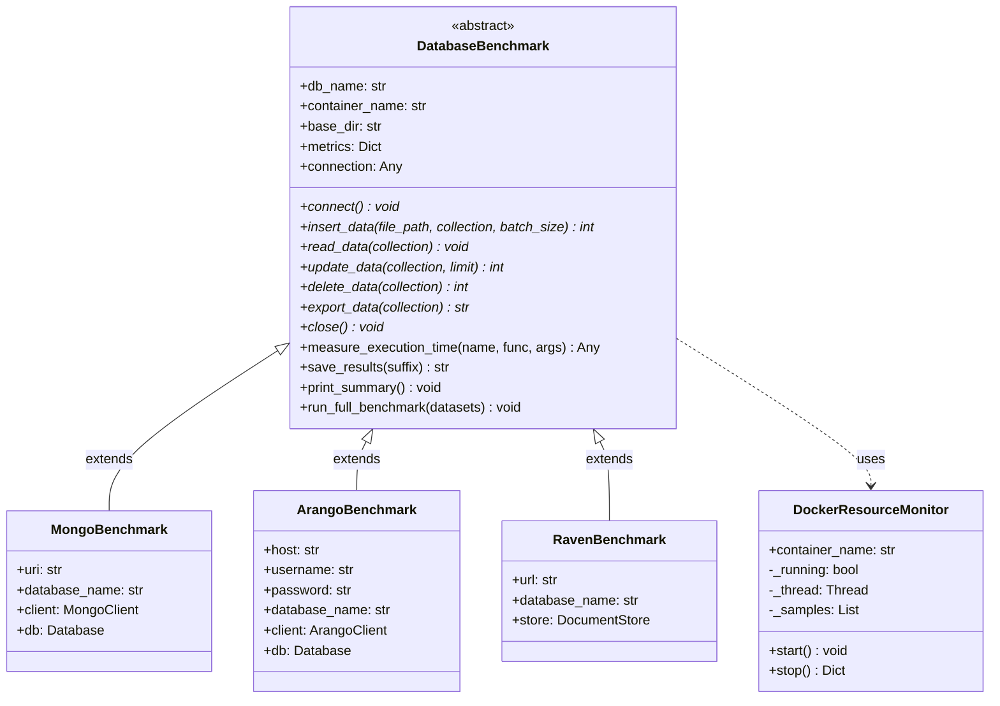

# Database Benchmarking Suite - Architecture

A modular, Object-Oriented benchmarking framework for comparing NoSQL document databases: **MongoDB**, **ArangoDB**, and **RavenDB**.

---

## 📋 Table of Contents

- [Overview](#overview)
- [Architecture Diagram](#architecture-diagram)
- [Project Structure](#project-structure)
- [Core Components](#core-components)
- [Monitoring Stack](#monitoring-stack)
- [CRUD Queries](#crud-queries)
- [Design Patterns](#design-patterns)
- [Usage](#usage)
- [Extending the Framework](#extending-the-framework)

---

## Overview

This benchmarking suite evaluates document-oriented databases on:

- **Import Performance**: Bulk data loading
- **CRUD Operations**: Create, Read, Update, Delete
- **Export Performance**: Data extraction
- **Resource Usage**: Real-time CPU and RAM monitoring via Prometheus/Grafana

### Key Features

- Abstract Base Class (ABC) pattern for consistency
- Docker container resource monitoring (cAdvisor + docker stats)
- Real-time metrics visualization (Grafana dashboards)
- Polymorphic benchmark execution
- CLI interface with flexible options
- Unified metrics output (JSON + CSV)

---

## Architecture Diagram



---

## Project Structure

```
DB_benchmarking/
├── main.py                          # CLI entry point
│
├── src/                             # Source package
│   ├── __init__.py
│   ├── base/                        # Abstract components
│   │   ├── benchmark_base.py        # DatabaseBenchmark ABC
│   │   └── resource_monitor.py      # DockerResourceMonitor
│   └── databases/                   # Concrete implementations
│       ├── mongo_impl.py            # MongoBenchmark
│       ├── arango_impl.py           # ArangoBenchmark
│       └── raven_impl.py            # RavenBenchmark
│
├── monitoring/                      # Monitoring stack
│   ├── prometheus.yml               # Scrape configuration
│   └── grafana/
│       ├── provisioning/            # Auto-provisioning
│       │   ├── datasources/
│       │   └── dashboards/
│       └── dashboards/
│           └── db-benchmark.json    # Pre-built dashboard
│
├── data/                            # Input datasets
├── results/                         # Output metrics
├── docs/                            # Documentation
└── docker-compose.yml               # All services
```

---

## Monitoring Stack

### Infrastructure

| Service                    | Port | Purpose                           |
| -------------------------- | ---- | --------------------------------- |
| **Prometheus**       | 9090 | Metrics collection & storage      |
| **Grafana**          | 3000 | Dashboard visualization           |
| **cAdvisor**         | 8082 | Container CPU/RAM/Network metrics |
| **node-exporter**    | 9100 | Host system metrics               |
| **mongodb-exporter** | 9216 | MongoDB-specific metrics          |

### Architecture

```
┌──────────────┐     ┌──────────────┐     ┌──────────────┐
│   Grafana    │────▶│  Prometheus  │────▶│  Exporters   │
│   :3000      │     │   :9090      │     │              │
└──────────────┘     └──────────────┘     └──────────────┘
                            │
        ┌───────────────────┼───────────────────┐
        ▼                   ▼                   ▼
┌──────────────┐   ┌──────────────┐   ┌──────────────┐
│ mongodb-exp  │   │   cAdvisor   │   │ node-export  │
└──────────────┘   └──────────────┘   └──────────────┘
```

### Access URLs

| Service    | URL                   | Credentials |
| ---------- | --------------------- | ----------- |
| Grafana    | http://localhost:3000 | admin/admin |
| Prometheus | http://localhost:9090 | -           |
| cAdvisor   | http://localhost:8082 | -           |

---

## CRUD Queries

### Dataset-Specific Queries

Operations use realistic queries tailored to each dataset:

| Dataset             | Read/Update Query                                                          |
| ------------------- | -------------------------------------------------------------------------- |
| **Amazon**    | `Score > 4 OR Summary contains 'good'`                                   |
| **Goodreads** | `rating >= 3 OR review_text contains ['Fantastic', 'suspense', 'story']` |

### Implementation Details

| Database           | Query Mechanism                                   |
| ------------------ | ------------------------------------------------- |
| **MongoDB**  | `$or` with `$regex` for text search           |
| **ArangoDB** | AQL `FILTER` with `CONTAINS()`                |
| **RavenDB**  | Numeric filters only (full-text requires indexes) |

> **Note**: RavenDB's `search()` requires full-text indexes. For fair comparison, RavenDB uses simpler numeric filters.

---

## Core Components

### 1. DatabaseBenchmark (Abstract Base Class)

**Location**: `src/base/benchmark_base.py`

| Method                       | Type     | Description                    |
| ---------------------------- | -------- | ------------------------------ |
| `connect()`                | Abstract | Establish database connection  |
| `insert_data()`            | Abstract | Bulk import from file          |
| `read_data()`              | Abstract | Read operations (find, filter) |
| `update_data()`            | Abstract | Update up to 10,000 documents  |
| `delete_data()`            | Abstract | Delete updated documents       |
| `export_data()`            | Abstract | Export collection to file      |
| `close()`                  | Abstract | Close connection               |
| `measure_execution_time()` | Concrete | Time + resource wrapper        |
| `run_full_benchmark()`     | Concrete | Template method orchestrator   |

### 2. DockerResourceMonitor

**Location**: `src/base/resource_monitor.py`

Background thread that samples Docker container metrics via `docker stats`.

### 3. Database Implementations

| Class               | Location                         | Driver         |
| ------------------- | -------------------------------- | -------------- |
| `MongoBenchmark`  | `src/databases/mongo_impl.py`  | PyMongo        |
| `ArangoBenchmark` | `src/databases/arango_impl.py` | python-arango  |
| `RavenBenchmark`  | `src/databases/raven_impl.py`  | ravendb-python |

---

## Design Patterns

### Template Method Pattern

`run_full_benchmark()` defines the algorithm skeleton.

### Strategy Pattern

Each database provides its own strategy for abstract methods.

### Decorator Pattern

`measure_execution_time()` wraps operations with timing and monitoring.

---

## Usage

### Start the Environment

```bash
cd DB_benchmarking
docker compose up -d
```

### Run Benchmarks

```bash
# All databases
python main.py

# Specific database(s)
python main.py --db mongodb
python main.py --db arangodb ravendb

# List available databases
python main.py --list
```

### Monitor in Real-Time

1. Open Grafana: http://localhost:3000
2. Navigate to "Database Benchmark Dashboard"
3. Run benchmark and watch metrics live

---

## Extending the Framework

### Adding a New Database

1. Create `src/databases/newdb_impl.py`:

```python
from ..base import DatabaseBenchmark

class NewDBBenchmark(DatabaseBenchmark):
    def __init__(self, base_dir: str, **kwargs):
        super().__init__("NewDB", "container_name", base_dir)
  
    def connect(self) -> None: ...
    def insert_data(self, file_path, collection, batch_size=10000) -> int: ...
    def read_data(self, collection) -> None: ...
    def update_data(self, collection, limit=10000) -> int: ...
    def delete_data(self, collection) -> int: ...
    def export_data(self, collection) -> str: ...
    def close(self) -> None: ...
```

2. Update `src/databases/__init__.py`
3. Add configuration to `main.py`

---

## Dependencies

```txt
pandas>=1.5.0
pymongo>=4.0.0
python-arango>=7.0.0
ravendb>=5.2.0
```
