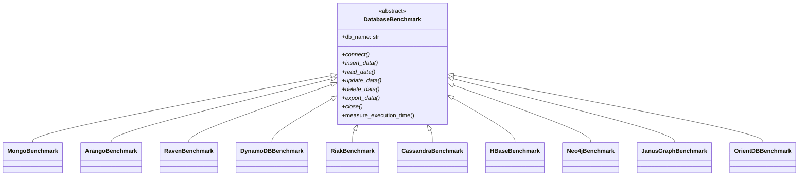
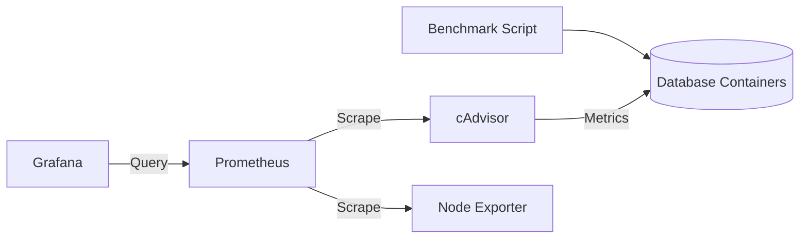

# 🏗️ System Architecture

This document details the technical architecture of the **NoSQL Multi-Model Benchmark Suite**. The project follows a modular, Object-Oriented design adhering to SOLID principles to ensure extensibility across different NoSQL families.

---

## 📋 Table of Contents
- [High-Level Overview](#high-level-overview)
- [Class Hierarchy](#class-hierarchy)
- [Core Components](#core-components)
- [Monitoring Stack](#monitoring-stack)
- [System Configuration](#system-configuration)
- [Design Patterns](#design-patterns)

---

## High-Level Overview

The benchmarking framework is built around a single abstract base class (`DatabaseBenchmark`) that defines the contract for all database interactions. This allows different runners (`main.py`, `main_kv.py`, etc.) to treat all 11 supported databases polymorphically.

### Supported Models
1.  **Document**: MongoDB, ArangoDB, RavenDB
2.  **Key-Value**: DynamoDB, Riak KV
3.  **Column-Oriented**: Cassandra, HBase
4.  **Graph**: Neo4j, JanusGraph, OrientDB

---

## Class Hierarchy

```mermaid
classDiagram
    class DatabaseBenchmark {
        <<abstract>>
        +db_name: str
        +connect()*
        +insert_data()*
        +read_data()*
        +update_data()*
        +delete_data()*
        +export_data()*
        +close()*
        +measure_execution_time()
    }

    class MongoBenchmark
    class ArangoBenchmark
    class RavenBenchmark
    class DynamoDBBenchmark
    class RiakBenchmark
    class CassandraBenchmark
    class HBaseBenchmark
    class Neo4jBenchmark
    class JanusGraphBenchmark
    class OrientDBBenchmark

    DatabaseBenchmark <|-- MongoBenchmark
    DatabaseBenchmark <|-- ArangoBenchmark
    DatabaseBenchmark <|-- RavenBenchmark
    DatabaseBenchmark <|-- DynamoDBBenchmark
    DatabaseBenchmark <|-- RiakBenchmark
    DatabaseBenchmark <|-- CassandraBenchmark
    DatabaseBenchmark <|-- HBaseBenchmark
    DatabaseBenchmark <|-- Neo4jBenchmark
    DatabaseBenchmark <|-- JanusGraphBenchmark
    DatabaseBenchmark <|-- OrientDBBenchmark
```

---

## Core Components

### 1. Abstract Base Class (`src/base/benchmark_base.py`)
Defines the standard lifecycle of a benchmark:
- **`connect()`**: Establish connection to the database.
- **`insert_data()`**: Ingest dataset (files or synthetic generation).
- **`read_data()`**: Execute read queries (Point Lookup, Range Scan, or Traversal).
- **`measure_execution_time()`**: Decorator extracting execution duration and resource usage.

### 2. Implementation Layer (`src/databases/`)
Each database has a dedicated implementation file encapsulating its driver logic.

| Family | Database | Implementation File | Driver |
| :--- | :--- | :--- | :--- |
| **Document** | MongoDB | `mongo_impl.py` | `pymongo` |
| | ArangoDB | `arango_impl.py` | `python-arango` |
| | RavenDB | `raven_impl.py` | `ravendb-python` |
| **Key-Value** | DynamoDB | `dynamodb_impl.py` | `boto3` |
| | Riak | `riak_impl.py` | `riak` |
| **Column** | Cassandra | `cassandra_impl.py` | `cassandra-driver` |
| | HBase | `hbase_impl.py` | `happybase` |
| **Graph** | Neo4j | `neo4j_impl.py` | `neo4j` |
| | JanusGraph | `janusgraph_impl.py` | `gremlinpython` |
| | OrientDB | `orientdb_impl.py` | `pyorient` |

---

## Monitoring Stack

The project uses a sidecar monitoring architecture running via Docker Compose.

### Layout

```mermaid
graph LR
    App[Benchmark Script] --> DB[(Database Containers)]
    cAdvisor[cAdvisor] -->|Metrics| DB
    Prometheus[Prometheus] -->|Scrape| cAdvisor
    Prometheus -->|Scrape| NodeExp[Node Exporter]
    Grafana[Grafana] -->|Query| Prometheus
```

### Components
- **cAdvisor (Port 8082)**: Collects real-time CPU, Memory, and Network I/O from running containers.
- **Prometheus (Port 9090)**: Time-series database storing metrics scraped from cAdvisor.
- **Grafana (Port 3000)**: Visualization dashboard connected to Prometheus.

---

## System Configuration

All benchmarks were executing on a local machine with the following specifications:

### Hardware Resources
*   **CPU:** AMD Ryzen 7 7735HS with Radeon Graphics (8 cores, 16 threads)
*   **RAM:** 16 GB DDR5
*   **Storage:** SSD NVMe
*   **OS:** Linux (Ubuntu/Debian based)

### Container Configuration
Specific resource limits were applied to memory-intensive containers via `docker-compose.yml`:

| Container | Memory Limit | Java Heap (Xmx) | Notes |
| :--- | :--- | :--- | :--- |
| **DynamoDB Local** | 8 GB | 6 GB | Increased for Goodreads dataset import |
| **Riak KV** | 6 GB | Default | Prevented OOM kills on bulk inserts |
| **Cassandra** | N/A | 2 GB | Standard configuration |
| **Graph DBs** | N/A | Default | Neo4j, JanusGraph, OrientDB (No explicit limits) |

---

## Design Patterns

1.  **Template Method**: The `DatabaseBenchmark.run_full_benchmark()` method defines the skeleton of the benchmark process, letting subclasses override specific steps (`insert`, `read`).
2.  **Strategy Pattern**: Use of differentRunner scripts (`main.py`, `main_graph.py`) to select different sets of database strategies.
3.  **Decorator Pattern**: Authorization and Timing logic is wrapped around core methods to separate concerns from the business logic.
