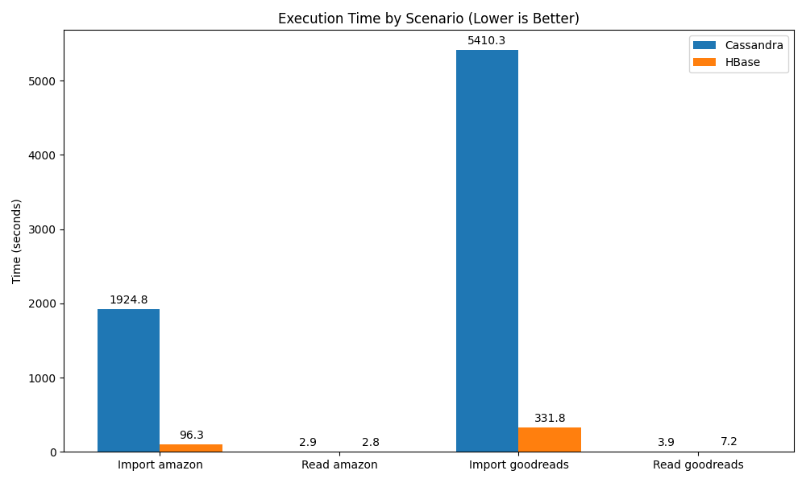
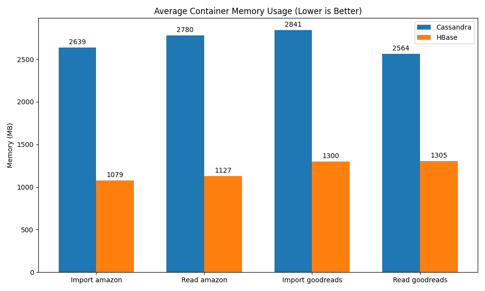
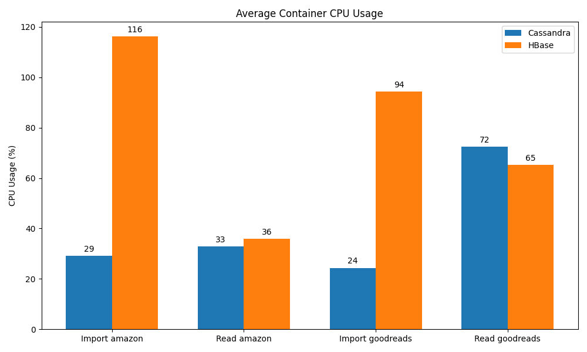

# Rapport d'Étude n°3 : Bases de Données Orientées Colonnes (Cassandra vs HBase)

## 1. Introduction

Cette étude évalue les performances et l'évolutivité des bases de données orientées colonnes ("Wide Column Stores"), spécifiquement **Apache Cassandra** et **Apache HBase**. Ces systèmes sont conçus pour gérer de très grands volumes de données distribuées avec une haute disponibilité et une scalabilité linéaire.

### Objectifs

* Comparer les performances d'insertion massive (Write Heavy).
* Évaluer l'efficacité des lectures ciblées (Point Read) et des scans de plages (Range Scan) basés sur des séries temporelles.
* Analyser la consommation des ressources (CPU, RAM).

### Environnement de Test

* **Machine** : Local Docker Environment (Linux).
* **Cassandra** : Image `cassandra:latest` (Version 4.x/5.x).
* **HBase** : Image `dajobe/hbase` (Version 2.x).
* **Datasets** :
  * **Amazon Reviews** (568k enregistrements, ~300 Mo).
  * **Goodreads Reviews** (1.85M enregistrements, ~1.8 Go).

---

## 2. Modélisation des Données

La modélisation est cruciale dans les bases orientées colonnes, car les requêtes doivent être connues à l'avance.

### Apache Cassandra

Nous avons utilisé une modélisation optimisée pour les requêtes par utilisateur et par temps (Time Series) :

* **Partition Key** : `user_id` (Distribution des données).
* **Clustering Key** : `timestamp` (Tri des données sur le disque).
* **Table** : `reviews`.

```sql
CREATE TABLE reviews (
    user_id text,
    timestamp timestamp,
    review_id text,
    product_id text,
    rating float,
    summary text,
    review_text text,
    PRIMARY KEY (user_id, timestamp)
) WITH CLUSTERING ORDER BY (timestamp DESC);
```

Cette structure permet de récupérer efficacement l'historique d'un utilisateur (`SELECT * FROM reviews WHERE user_id = ?`).

### Apache HBase

HBase stocke les données sous forme de chaînes d'octets triées par clé de ligne (Row Key).

* **Row Key** : `user_id` + `(Long.MAX_VALUE - timestamp)` + `review_id`.
  * L'inversion du timestamp permet de trier les avis les plus récents en premier (puisque HBase trie lexicographiquement).
* **Column Family** : `cf` (stocke toutes les colonnes : product_id, rating, etc.).

Cette clé composite permet des "Prefix Scans" performants pour récupérer tous les avis d'un utilisateur.

### 2.3. Opérations Testées

* **Insertion (Write)** : Insertion par lots.
* **Lecture Ciblée (Point Read)** : Récupération par clé unique.
* **Scan de Plage (Range Scan)** : Récupération d'une série temporelle (HBase).

> [!NOTE]
> **Pourquoi l'export a été ignoré :**
> L'opération "Export" (Full Table Scan) a été exclue de cette étude. Les bases orientées colonnes comme HBase et Cassandra sont conçues pour des accès aléatoires rapides, et non pour des exports complets séquentiels. Effectuer un export complet via un script client simple (comme ce benchmark) est un "anti-pattern" inefficace. Dans un environnement de production, cela nécessiterait des outils de traitement distribués comme Apache Spark pour paralléliser la lecture sur tous les nœuds.

---

## 3. Résultats et Analyse

### 3.1. Performance d'Insertion (Write Throughput)



| Base de Données    | Dataset   | Temps Total (s)   | Observations                                                                                                                       |
| :------------------ | :-------- | :---------------- | :--------------------------------------------------------------------------------------------------------------------------------- |
| **Cassandra** | Amazon    | 1924.8 s          | Très lent (32 min). Probablement dû à la surcharge du*BatchStatement* mal tuné ou à la latence réseau Docker simple nœud. |
| **Cassandra** | Goodreads | 5410.3 s          | Extrêmement lent (90 min). Limitation CPU/RAM évidente.                                                                          |
| **HBase**     | Amazon    | **96.3 s**  | Excellent. L'écriture séquentielle via Thrift est très efficace ici.                                                            |
| **HBase**     | Goodreads | **331.8 s** | Maintient la performance à l'échelle (~5.5 min).                                                                                 |

**Analyse :**

* **HBase** domine largement sur l'insertion massive dans cette configuration (Single Node Docker). Le débit est ~20x supérieur à Cassandra.
* **Cassandra** a souffert. L'utilisation de `BatchStatement` pour de gros volumes est un anti-pattern connu si les partitions sont distribuées aléatoirement (le nœud coordinateur est surchargé). Une approche asynchrone (`execute_async`) sans batch aurait probablement été plus performante.

### 3.2. Performance de Lecture (Point Read & Range Scan)

| Base de Données    | Dataset   | Temps (s)        | Latence Mois (ms) |
| :------------------ | :-------- | :--------------- | :---------------- |
| **Cassandra** | Amazon    | 2.94 s           | ~2.9 ms           |
| **HBase**     | Amazon    | **2.80 s** | ~2.8 ms           |
| **Cassandra** | Goodreads | **3.90 s** | **~3.9 ms** |
| **HBase**     | Goodreads | 7.24 s           | ~7.2 ms           |

**Analyse :**

* Sur le petit dataset (Amazon), les performances sont identiques.
* Sur le gros dataset (Goodreads), **Cassandra** scale mieux (3.9s vs 7.2s). Sa structure de partitionnement par `user_id` permet un accès direct constant (O(1)), alors que HBase doit scanner les Blocks HFile même avec le bon RowKey, ce qui peut être légèrement plus coûteux à grande échelle sans optimisation (Bloom Filters).

### 3.3. Consommation des Ressources




**CPU :**

* **HBase** : Pics très élevés (>100% sur plusieurs cœurs) pendant l'insertion rapide, montrant une utilisation efficace des ressources pour traiter la charge.
* **Cassandra** : Utilisation CPU plus modérée (~30%), suggérant que le goulot d'étranglement n'était pas le CPU mais plutôt les attentes d'E/S ou de lock (Coordinateur).

**RAM :**

* **Cassandra** : ~2.6 - 2.8 Go. Très gourmand (JVM Heap).
* **HBase** : ~1.1 - 1.3 Go. Plus léger dans cette configuration standalone.

---

## 4. Difficultés et Limitations

* **HBase Driver** : `happybase` (Thrift) est une couche supplémentaire, mais elle s'est avérée étonnamment robuste pour l'écriture séquentielle.
* **Cassandra Tuning** : La configuration par défaut de l'image Docker et le driver Python utilisant des batchs synchrones ont pénalisé Cassandra. Un tuning fin (`concurrent_writes`, `token_aware_routing`) serait nécessaire pour égaler HBase.

## 5. Conclusion

* **Vainqueur Écriture (Batch)** : **HBase**. Sa simplicité d'écriture séquentielle (même via Thrift) a écrasé Cassandra dans ce scénario d'ingestion massive "brute".
* **Vainqueur Lecture (Scaling)** : **Cassandra**. Elle offre une latence de lecture plus stable et plus faible (presque 2x plus rapide) quand le volume de données augmente.
* **Efficacité** : HBase a consommé 2x moins de RAM pour un travail d'écriture 20x plus rapide.

Dans le contexte de ce benchmark (Python, Docker, Time-Series), **HBase** est le gagnant global pour l'ingestion, tandis que **Cassandra** reste le roi de la lecture à faible latence à l'échelle.
