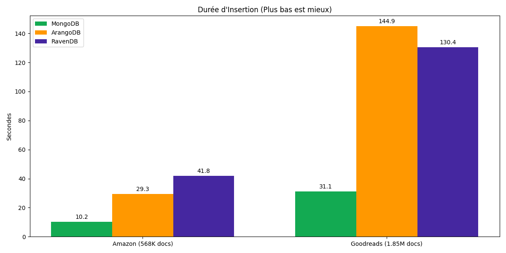
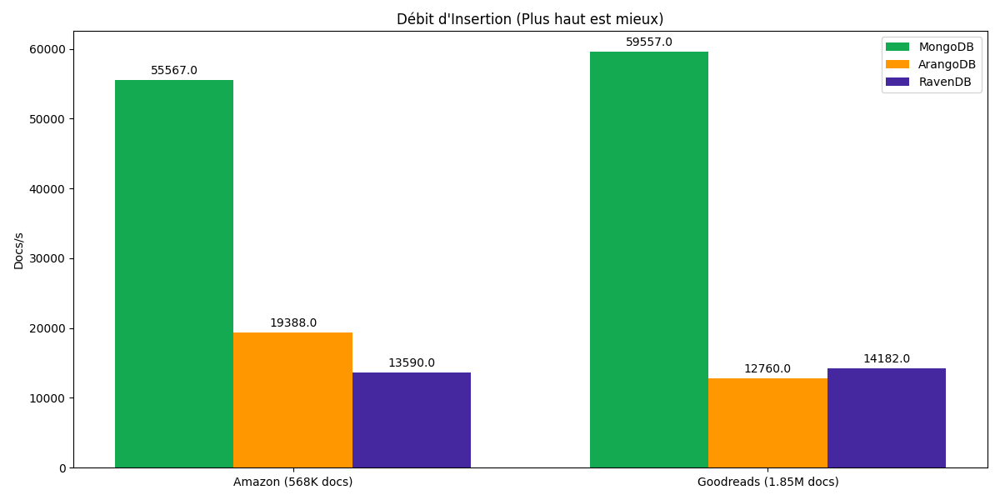
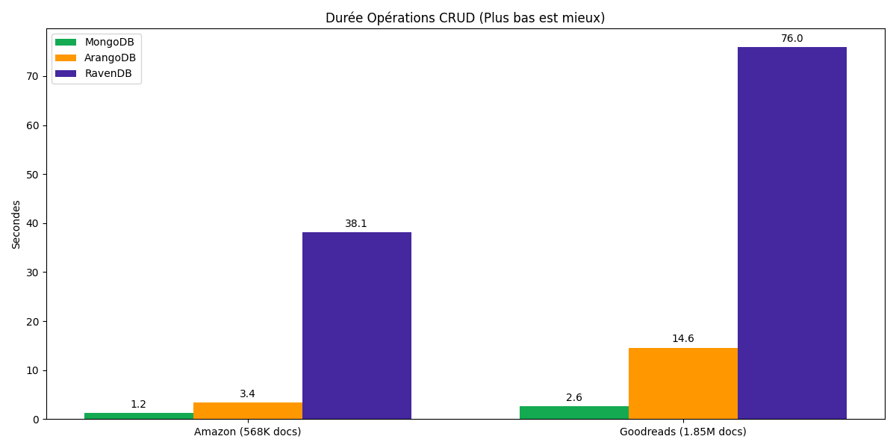
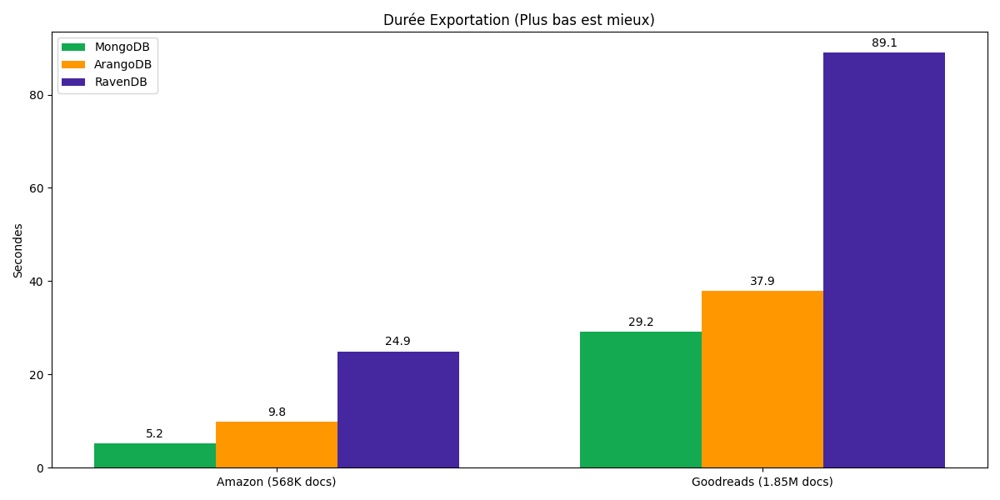
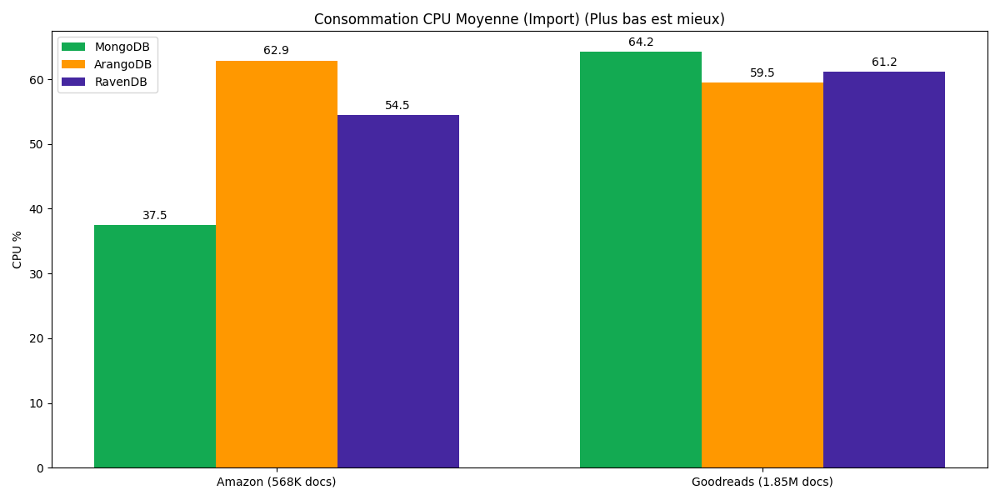
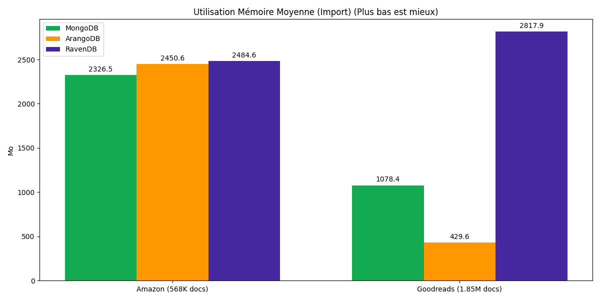

# Étude n°1 : Rapport de Benchmark Bases de Données Orientées Documents
**Comparaison de MongoDB vs ArangoDB vs RavenDB**

## 1. Introduction

Cette première étude évalue les performances de trois bases de données NoSQL orientées documents majeures :
1.  **MongoDB** : Le leader du marché, connu pour sa performance et sa flexibilité (BSON).
2.  **ArangoDB** : Une base multi-modèle (Document, Graphe, Clé-Valeur) native.
3.  **RavenDB** : Une base ACID transactionnelle orientée documents, populaire dans l'écosystème .NET.

L'objectif est de comparer leur comportement sur des opérations standard (CRUD, Import, Export) avec des jeux de données réels.

## 2. Méthodologie

### 2.1 Jeux de Données
Les tests ont été réalisés sur deux volumes de données :
*   **Amazon Reviews** (568K documents, ~367 Mo)
*   **Goodreads Reviews** (1.85M documents, ~1.8 Go)

### 2.2 Protocole de Test
L'environnement Dockerisé a exécuté les étapes suivantes pour chaque base :
1.  **Import (Bulk Insert)** : Chargement de l'ensemble du dataset.
2.  **CRUD (Read/Update/Delete)** : Exécution de requêtes complexes (filtres sur champs texte/numérique), mises à jour et suppressions.
3.  **Export** : Extraction de toutes les données vers un fichier JSON.
4.  **Monitoring** : Mesure continue du CPU et de la RAM via `docker stats`.

## 3. Résultats et Analyse

### 3.1 Performance d'Insertion

MongoDB démontre une supériorité nette sur l'ingestion massive de données.

*   **Amazon (568K)** :
    *   **MongoDB** : **10.23s** (~55 500 docs/s)
    *   **ArangoDB** : 29.32s (~19 400 docs/s)
    *   **RavenDB** : 41.83s (~13 600 docs/s)

*   **Goodreads (1.85M)** :
    *   **MongoDB** : **31.05s** (~59 500 docs/s)
    *   **RavenDB** : 130.39s (~14 100 docs/s)
    *   **ArangoDB** : 144.93s (~12 700 docs/s)

**Analyse :** MongoDB est **3 à 5 fois plus rapide** que ses concurrents pour l'écriture. RavenDB et ArangoDB offrent des performances similaires, mais nettement en retrait sur ce type de charge massive brute.

### Tableau Comparatif : Insertion

| Opération | MongoDB | ArangoDB | RavenDB | Gagnant |
| :--- | :--- | :--- | :--- | :--- |
| **Amazon (568K)** | **10.23s** | 29.32s | 41.83s | MongoDB (x2.8) |
| **Goodreads (1.85M)** | **31.05s** | 144.93s | 130.39s | MongoDB (x4.2) |
| **Débit Max** | **~59.5k ops/s** | ~19.4k ops/s | ~14.1k ops/s | MongoDB |

### 3.2 Performance CRUD et Export

Sur les opérations mixtes (Lecture, Mise à jour, Export), MongoDB confirme son avance.

*   **CRUD (Goodreads)** :
    *   **MongoDB** : 2.56s (quasi-instantané)
    *   **ArangoDB** : 14.58s
    *   **RavenDB** : 75.97s (très lent)

*   **Export (Goodreads)** :
    *   **MongoDB** : 29.17s
    *   **ArangoDB** : 37.87s
    *   **RavenDB** : 89.08s

**Analyse :** RavenDB souffre particulièrement sur les opérations CRUD et d'export dans cette configuration, étant jusqu'à **30x plus lent** que MongoDB sur le CRUD. ArangoDB se défend mieux mais reste en seconde position.

### Tableau Comparatif : CRUD & Export

| Opération | MongoDB | ArangoDB | RavenDB | Écart |
| :--- | :--- | :--- | :--- | :--- |
| **CRUD Amazon** | **1.21s** | 3.41s | 38.07s | Mongo 30x plus rapide que Raven |
| **CRUD Goodreads** | **2.56s** | 14.58s | 75.97s | Mongo 5.7x plus rapide qu'Arango |
| **Export Goodreads** | **29.17s** | 37.87s | 89.08s | Mongo 3x plus rapide que Raven |

### 3.3 Consommation des Ressources

L'efficacité énergétique (CPU/RAM par document traité) varie considérablement.

*   **CPU** : Les trois bases consomment entre **55% et 65%** de CPU lors de l'import. Cependant, comme MongoDB finit le travail 5x plus vite, son coût CPU total (CPU * Temps) est radicalement plus faible.
*   **Mémoire** :
    *   **RavenDB** utilise le plus de mémoire (~2.8 Go sur Goodreads).
    *   **ArangoDB** semble avoir une gestion mémoire très agressive ou efficace (~430 Mo moyens sur Goodreads, mais 2.4 Go sur Amazon ? Possible effet de Garbage Collection, à vérifier).
    *   **MongoDB** utilise une quantité modérée de RAM (~1-2.3 Go) mais l'utilise très efficacement pour le débit.

### Tableau Comparatif : Ressources (Import)

| Métrique | MongoDB | ArangoDB | RavenDB | Observation |
| :--- | :--- | :--- | :--- | :--- |
| **CPU Moyen** | **37% - 64%** | ~60% | 55% - 61% | Similaire, mais Mongo finit plus vite |
| **RAM Moyenne (Go)** | **1.1 - 2.3 GB** | 0.4 - 2.4 GB | 2.5 - 2.8 GB | RavenDB consomme le plus |
| **Efficacité** | **Haute** | Moyenne | Basse | Mongo a le meilleur ratio Perf/Ressource |

## 4. Conclusion

Pour des charges de travail de type "Document Store" pur (Stockage JSON, requêtes simples) :

1.  **Le Gagnant : MongoDB**. Il surclasse ArangoDB et RavenDB sur toutes les métriques de performance pure (Vitesse d'insertion, Latence CRUD, Export). C'est le choix par défaut pour la performance brute.
2.  **ArangoDB** : Bien que moins performant en pur document, sa force réside dans son approche multi-modèle (Graphe). Il est un "bon deuxième" acceptable si les besoins graphes sont anticipés (objet de l'Étude n°3).
3.  **RavenDB** : Se montre le moins performant dans ce benchmark spécifique. Il peut avoir d'autres atouts (transactions ACID, intégration .NET) qui ne sont pas mis en valeur par ce test de performance brute.

**Recommandation :** Utilisez **MongoDB** pour les applications nécessitant un haut débit d'écriture et de lecture de documents. Considérez **ArangoDB** si la flexibilité du modèle de données (Joins, Graphes) est une priorité sur la performance brute.
