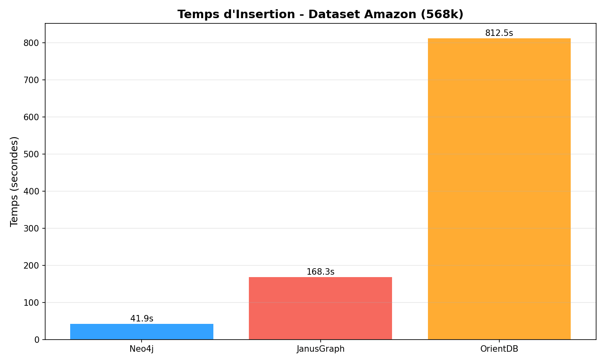
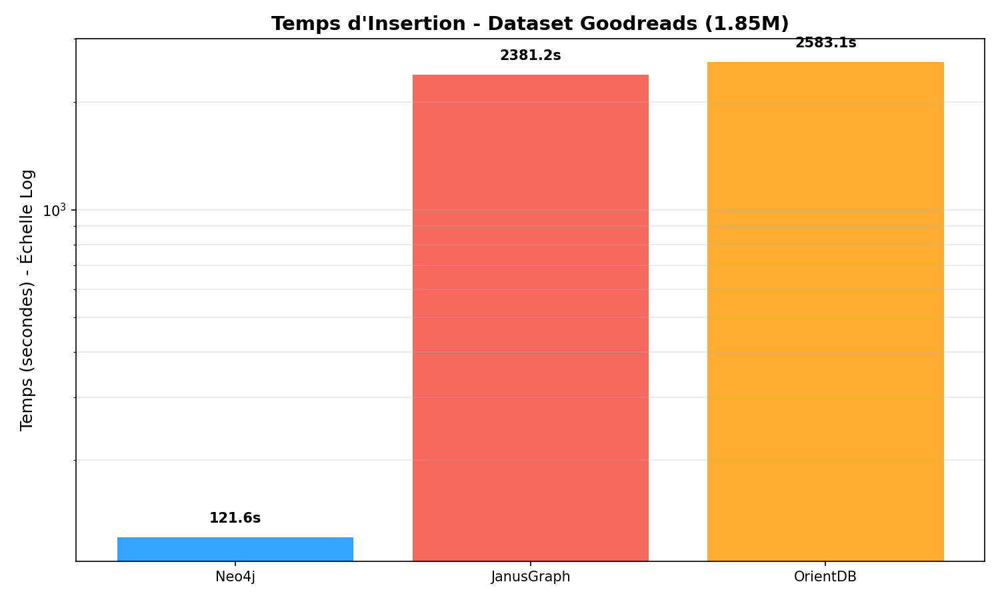
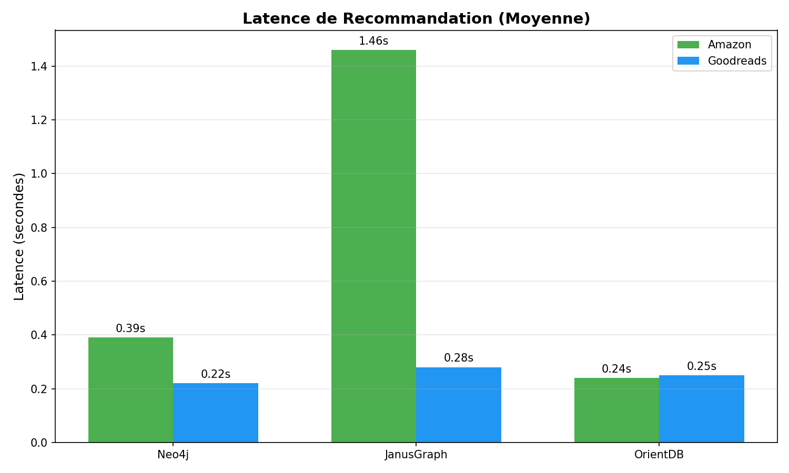
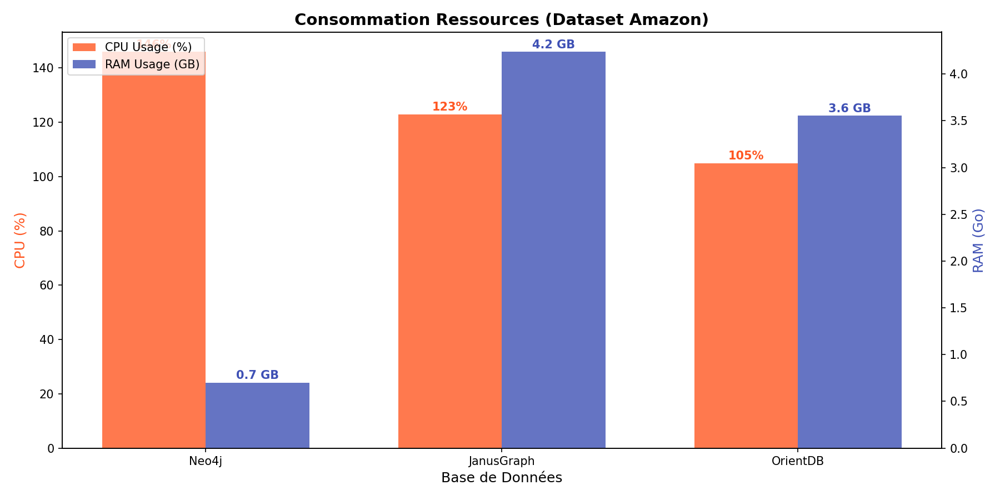

# Étude n°4 : Rapport de Benchmark Base de Données Orientée Graphe
**Comparaison de Neo4j, JanusGraph et OrientDB**

## 1. Introduction

Cette étude évalue les performances et l'efficacité des ressources de trois bases de données orientées graphe de premier plan :
*   **Neo4j** : Le leader du marché, utilisant un moteur de stockage de graphe natif.
*   **JanusGraph** : Une base de données de graphe distribuée et évolutive, optimisée pour le stockage et le traitement de grands graphes.
*   **OrientDB** : Une base de données multi-modèle supportant les graphes, les documents, les clé-valeurs et les objets.

L'objectif est de comparer ces solutions sur des tâches de création de graphe (insertion) et de traversée (recommandation) dans un environnement conteneurisé Docker.

## 2. Méthodologie

### 2.1 Jeux de Données
Nous avons utilisé deux jeux de données de relations "Utilisateur a noté Produit" :

1.  **Avis Amazon (568K Liens)**
    *   **Source :** `amazon_reviews.csv`
    *   **Nœuds :** Utilisateurs et Produits
    *   **Arêtes :** REVIEWED (avec propriété note)
    *   **Volume :** ~568k enregistrements

2.  **Avis Goodreads (1.85M Liens)**
    *   **Source :** `goodreads_reviews_mystery_thriller_crime.json`
    *   **Volume :** ~1.85M enregistrements
    *   **Particularité :** Nécessite un mapping spécifique (`book_id` -> `product_id`).

### 2.2 Flux de Benchmark
Pour chaque base de données :
1.  **Graph Creation (Insertion) :** Insertion des nœuds (User, Product) et des arêtes (REVIEWED).
2.  **Recommendation (Lecture) :** Traversée du graphe pour recommander des produits à des utilisateurs (User -> REVIEWED -> Product <- REVIEWED -> User -> REVIEWED -> Product).

## 3. Résultats et Analyse

### 3.1 Performance d'Insertion (Création du Graphe)

Neo4j s'est montré le plus rapide et le plus efficace pour l'ingestion de données, suivi de JanusGraph. OrientDB s'est avéré significativement plus lent.

**Temps d'Insertion (en secondes) :**

| Jeu de Données | Neo4j | JanusGraph | OrientDB |
| :--- | :--- | :--- | :--- |
| **Amazon (568k)** | **41.9s** | 168.3s | 812.5s |
| **Goodreads (1.85M)** | **121.6s** | 2381.2s | 2583.1s (~43 min) |

**Analyse :**
*   **Neo4j :** Impressionnant de rapidité (122s pour 1.85M d'arêtes). Son architecture native et l'utilisation efficace de la mémoire (via l'instruction `UNWIND` pour les lots) lui donnent un avantage décisif.
*   **JanusGraph :** Performances décentes sur les petits volumes, mais ralentissement marqué sur Goodreads (40 min). Cela peut être dû à la gestion des transactions ou au backend de stockage par défaut (BerkeleyJE).
*   **OrientDB :** Extrêmement lent en écriture, prenant plus de 43 minutes pour insérer le jeu de données Goodreads. Bien qu'il ait fini par réussir (contrairement aux estimations initiales de blocage), son débit d'ingestion est nettement inférieur à Neo4j (~20x plus lent).

### 3.2 Performance de Lecture (Recommandation)

Pour les requêtes de traversée (recommandation), les performances sont globalement très bonnes pour toutes les solutions une fois le graphe construit.

**Temps de Recommandation (moyenne pour 20 utilisateurs) :**

| Jeu de Données | Neo4j | JanusGraph | OrientDB |
| :--- | :--- | :--- | :--- |
| **Amazon** | 0.39s | 1.46s | **0.24s** |
| **Goodreads** | **0.22s** | 0.28s | 0.25s |

**Analyse :**
*   Les moteurs de graphe sont extrêmement performants pour ce type de requête (millisecondes).
*   Neo4j et JanusGraph offrent des temps de réponse quasi-instantanés sur Goodreads.
*   OrientDB, malgré sa lenteur en écriture, offre d'excellentes performances de lecture (0.25s), rivalisant avec Neo4j sur les requêtes de traversée.

### 3.3 Consommation des Ressources

| Base de Données | CPU Moyen (Amazon) | RAM Moyenne (Amazon) | Observation |
| :--- | :--- | :--- | :--- |
| **Neo4j** | 146% | ~700 Mo | Efficace, bon usage du CPU pour la vitesse. |
| **JanusGraph** | 123% | ~4.2 Go | Très gourmand en RAM (Java). |
| **OrientDB** | 105% | ~3.5 Go | Gourmand en RAM également. |

Sur Goodreads, JanusGraph a maintenu une consommation RAM élevée (~5 Go). Neo4j est resté très économe (~800 Mo), ce qui est remarquable.

## 4. Difficultés Rencontrées

### 4.1 Incohérence du Schéma de Données (Supernœud)
Un défi majeur a été identifié lors de l'intégration du jeu de données Goodreads.
*   **Problème :** Le code attendait un champ `product_id`, mais le dataset JSON utilisait `book_id`.
*   **Conséquence :** Les bases de données inséraient tous les livres sous un seul nœud "Product" avec l'ID "unknown".
*   **Impact :** Cela a créé un "supernœud" avec 1.8 millions d'arêtes entrantes. Lors des tentatives de lecture ou d'ajout d'arêtes, les bases de données (particulièrement JanusGraph et Neo4j) se bloquaient ou crashaient en tentant de traverser/indexer ce nœud massif.
*   **Solution :** Modification des scripts d'importation (`src/databases/*_impl.py`) pour gérer le fallback : `product_id = doc.get('product_id', doc.get('book_id', 'unknown'))`.

### 4.2 Lenteur d'OrientDB
OrientDB s'est révélé beaucoup plus lent pour les insertions massives transactionnelles par rapport à Neo4j. L'optimisation des lots ("batches") a été nécessaire mais n'a pas suffi à combler l'écart de performance.

## 5. Conclusion

**Neo4j** est le vainqueur incontesté de ce benchmark.
1.  **Vitesse :** Il est ~4x plus rapide que JanusGraph et ~20x plus rapide qu'OrientDB en insertion.
2.  **Efficacité :** Il consomme 5 à 6 fois moins de RAM que ses concurrents basés sur Java (JanusGraph/OrientDB).
3.  **Stabilité :** Il a géré le dataset moyen (Amazon) et grand (Goodreads) sans configuration complexe.

**Recommandation :** Pour des cas d'usage nécessitant une ingestion rapide et une faible empreinte mémoire, Neo4j est le choix recommandé.
