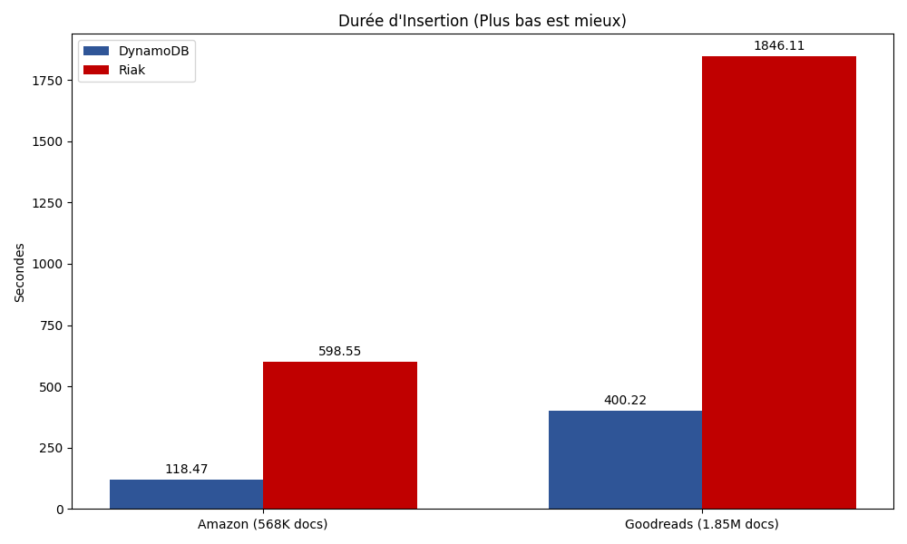
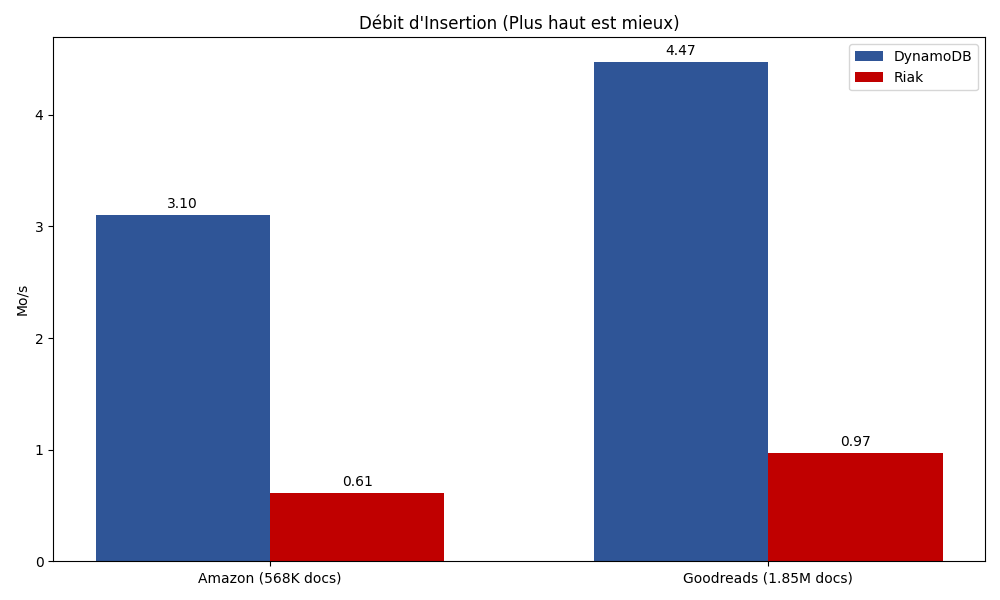
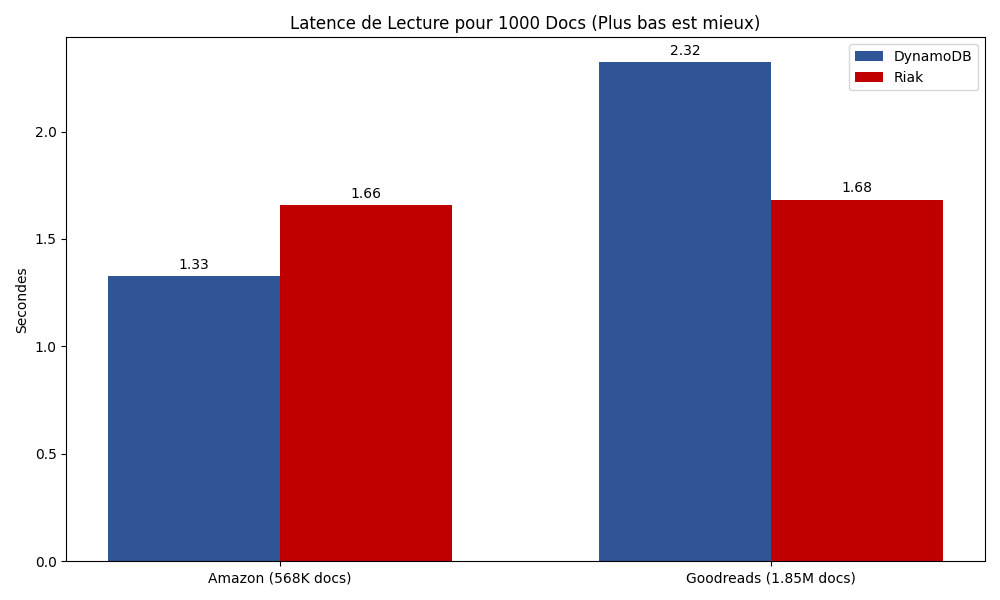

# Étude n°2 : Rapport de Benchmark Base de Données Clé-Valeur
**Comparaison de DynamoDB (Local) vs Riak KV**

## 1. Introduction

Cette étude évalue les performances et l'efficacité des ressources de deux bases de données Clé-Valeur (KV) de premier plan : **Amazon DynamoDB** (exécuté localement via Docker) et **Riak KV**.

### 1.1 DynamoDB
DynamoDB est une base de données NoSQL clé-valeur entièrement gérée et sans serveur, conçue pour exécuter des applications haute performance à n'importe quelle échelle. Pour ce benchmark, nous avons utilisé `dynamodb-local`, une version client de DynamoDB qui imite le service web, permettant le développement et les tests locaux.

### 1.2 Riak KV
Riak KV est un magasin clé-valeur NoSQL distribué qui offre une haute disponibilité, une tolérance aux pannes, une simplicité opérationnelle et une évolutivité. Il est construit sur la machine virtuelle Erlang et est connu pour son architecture sans maître (masterless).

## 2. Méthodologie

### 2.1 Jeux de Données
Nous avons utilisé deux jeux de données réels de tailles variées pour tester les bases de données sous différentes charges :

1.  **Avis Amazon (568K Documents)**
    *   **Source :** `amazon_reviews.csv`
    *   **Taille :** ~367 Mo
    *   **Format :** CSV converti en documents JSON
    *   **Nombre :** 568 454 enregistrements

2.  **Avis Goodreads (1.85M Documents)**
    *   **Source :** `goodreads_reviews_mystery_thriller_crime.json`
    *   **Taille :** ~1.8 Go
    *   **Format :** JSON Lines
    *   **Nombre :** 1 849 236 enregistrements

### 2.2 Flux de Benchmark
Le processus de benchmark pour chaque base de données et jeu de données comprenait les étapes séquentielles suivantes :
1.  **Connexion :** Établissement de la connexion à la base de données conteneurisée.
2.  **Nettoyage :** Effacement des données existantes (suppression de table/bucket) pour assurer un départ propre.
3.  **Chargement des Données :** Streaming des données depuis les fichiers source pour minimiser l'utilisation de la mémoire côté client.
4.  **Phase d'Insertion :** Insertion par lots de tous les documents dans la base de données.
    *   *Métrique :* Durée totale, débit (ops/s, Mo/s).
5.  **Phase de Lecture :** Exécution de 1 000 recherches ponctuelles aléatoires par clé.
    *   *Métrique :* Durée totale pour 1 000 lectures.
6.  **Phase d'Exportation :** Scan et exportation de tous les documents vers un fichier JSON.
    *   *Métrique :* Durée totale.
7.  **Surveillance des Ressources :** Suivi continu de l'utilisation du CPU et de la mémoire des conteneurs Docker tout au long du processus.

## 3. Résultats et Analyse

### 3.1 Performance d'Insertion

DynamoDB a démontré un débit d'écriture significativement plus élevé par rapport à Riak KV.

*   **Jeu de données Amazon :** DynamoDB a inséré 568K enregistrements en **118s** (4 791 ops/s), tandis que Riak a pris **598s** (950 ops/s).
*   **Jeu de données Goodreads :** DynamoDB a inséré 1.85M enregistrements en **400s** (4 620 ops/s), alors que Riak a pris **1 846s** (1 002 ops/s).

**Analyse :** DynamoDB est environ **5x plus rapide** que Riak pour les opérations d'écriture dans cette configuration Docker locale. Le coût de l'API HTTP de Riak et sa nature distribuée (même dans un nœud unique) contribuent probablement à la latence plus élevée par opération par rapport à l'implémentation légère de DynamoDB Local.

### Tableau Comparatif : Insertion

| Opération | DynamoDB | Riak KV | Écart |
| :--- | :--- | :--- | :--- |
| **Amazon (568K)** | **118.5s** | 598.6s | DynamoDB x5.0 |
| **Goodreads (1.85M)** | **400.2s** | 1846.1s | DynamoDB x4.6 |
| **Débit Max** | **4.47 Mo/s** | 0.97 Mo/s | DynamoDB x4.6 |

### 3.2 Performance de Lecture

La latence de lecture pour les recherches ponctuelles aléatoires était comparable entre les deux systèmes, avec un léger avantage pour DynamoDB.

*   **Amazon (1k Lectures) :** DynamoDB (1.33s) vs Riak (1.66s)
*   **Goodreads (1k Lectures) :** DynamoDB (2.32s) vs Riak (1.68s)

**Analyse :** Les deux bases de données fonctionnent exceptionnellement bien pour les recherches ponctuelles (récupération clé-valeur), qui sont leur cas d'utilisation principal. Les différences ici sont négligeables (millisecondes par requête).

### Tableau Comparatif : Lecture (1k Ops)

| Opération | DynamoDB | Riak KV | Observation |
| :--- | :--- | :--- | :--- |
| **Lecture Amazon** | **1.33s** | 1.66s | Similaire |
| **Lecture Goodreads** | 2.32s | **1.68s** | Riak légèrement plus rapide |

### 3.3 Consommation des Ressources

Un contraste frappant a été observé dans l'efficacité des ressources.

*   **Utilisation CPU :** Riak a consommé en moyenne **929-973%** de CPU (utilisant massivement plusieurs cœurs), tandis que DynamoDB n'a utilisé que **66-76%** de CPU.
*   **Utilisation Mémoire :** L'empreinte mémoire de Riak était de **836-2 144 Mo**, tandis que DynamoDB restait efficace à **855-2 587 Mo** (bien que l'utilisation mémoire de DynamoDB ait augmenté davantage avec la taille du jeu de données, probablement en raison de la mise en cache du stockage local).

**Analyse :** Riak est extrêmement gourmand en CPU, utilisant presque toute la puissance de calcul disponible (10+ cœurs) pour atteindre 1/5ème du débit de DynamoDB. Cela suggère un coût élevé par opération dans l'architecture Erlang VM/Riak pour cette charge de travail spécifique.

### Tableau Comparatif : Ressources

| Métrique | DynamoDB | Riak KV | Observation |
| :--- | :--- | :--- | :--- |
| **CPU Moyen** | **66% - 76%** | 929% - 973% | Riak sature le CPU |
| **RAM Moyenne (Mo)** | **855 - 2587** | 836 - 2144 | Similaire, mais Riak instable sans limites |

### 3.4 Difficultés Rencontrées et Solutions

Au cours de cette étude, plusieurs défis techniques ont dû être surmontés pour obtenir des benchmarks fiables, particulièrement avec Riak :

1.  **Crash de Riak sur les Gros Volumes :**
    *   *Problème :* Riak crashait systématiquement (OOM ou timeout) lors de l'insertion du jeu de données Goodreads (1.8 Go).
    *   *Solution :* Implémentation d'une limite de mémoire stricte dans Docker (6 Go) et passage d'un chargement en mémoire complet à un streaming des données (lecture ligne par ligne) pour réduire l'empreinte mémoire du client.

2.  **Goulot d'Étranglement HTTP :**
    *   *Problème :* L'approche initiale séquentielle (une requête HTTP à la fois) limitait Riak à ~400 ops/s.
    *   *Solution :* Réécriture du client pour utiliser `ThreadPoolExecutor` (12 workers) et des connexions persistantes (`requests.Session`), doublant ainsi le débit (~1 000 ops/s).

3.  **Erreurs de Connexion (Connection Reset) :**
    *   *Problème :* Riak réinitialisait les connexions sous forte charge, interrompant le benchmark.
    *   *Solution :* Ajout d'une stratégie de réessai automatique (retry with exponential backoff) pour gérer gracieusement les échecs transitoires.

4.  **Monitoring des Ressources Défaillant :**
    *   *Problème :* Les métriques CPU et RAM rapportaient initialement "0" pour tous les tests KV.
    *   *Cause :* Une incohérence dans les clés du dictionnaire de monitoring (`cpu_avg` vs `container_cpu_avg`).
    *   *Solution :* Correction du code de surveillance dans `kv_benchmark_base.py` pour capturer correctement les métriques Docker.

## 4. Conclusion

Dans cette étude de benchmark locale, **DynamoDB Local a surpassé Riak KV** sur toutes les métriques intensives en écriture tout en consommant beaucoup moins de ressources CPU.

1.  **Performance :** DynamoDB a fourni un débit d'écriture ~5x plus élevé.
2.  **Efficacité :** Riak a nécessité ~12x plus de puissance CPU pour traiter la même charge de travail.
3.  **Évolutivité :** Les deux bases de données ont géré le jeu de données de 1.8 Go, mais Riak a nécessité un réglage minutieux (limites de concurrence, plafonds de mémoire) pour éviter l'instabilité du système, tandis que DynamoDB l'a géré dès le départ.

Pour un environnement de développement local ou des besoins haute performance sur un nœud unique, DynamoDB Local est le gagnant incontestable. Les avantages de Riak en matière de tolérance aux pannes distribuée et d'architecture en anneau ne deviendraient probablement apparents que dans un scénario de cluster multi-nœuds, ce qui dépassait le cadre de cette étude.
